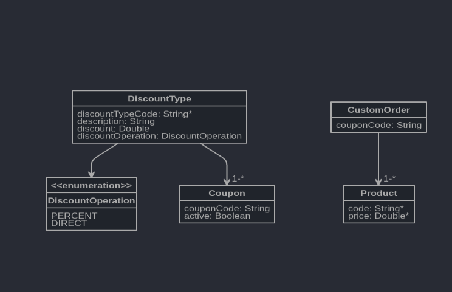

# Discounts API project

In this project I am going to build a Rest API in order to build the total price of a order for a given discount.

Technology stack used:

- Spring Boot 2.17 and Spring 5
- Maven
- Liquibase, for database migrations
- PostgresSQL 10.4
- Docker
- Project Lombok
- IntelliJ IDEA 2019.2 (Community Edition)
- OpenJDK version "11.0.4" 
- H2 database for testing

## Welcome to discounts API project 🚀

### Class diagram
This is the model representation of the entities.

### Database startup
Create and start the database named docker_discounts-postgresql_1 with docker, creating a container from the given yml file:

    docker-compose -f src/main/resources/docker/posgres.yml up

If we want to stop, restart, or remove this Docker container, we can use the following commands:

     docker stop docker_discounts-postgresql_1
     docker start docker_discounts-postgresql_1
     docker rm docker_discounts-postgresql_1

### Development

To start your application in the dev profile, simply run:

    mvn spring-boot:run
    
### Running tests
To run all tests we must do:

    mvn verify
    
#### Running Unit tests
We can run only unit tests with

    mvn clean test
    
### Running PIT Mutation tests
Run Pit mutation tests with

    mvn --fail-at-end clean test pitest:mutationCoverage pitest:report-aggregate-module
    
# Other improvements TODO

1. Use DTOs on resources/controllers and no the entities.
2. Add Spring Security
3. Add more integration test for calculate order discount
4. Add argument captors to some unit tests to validate the calls are done right

